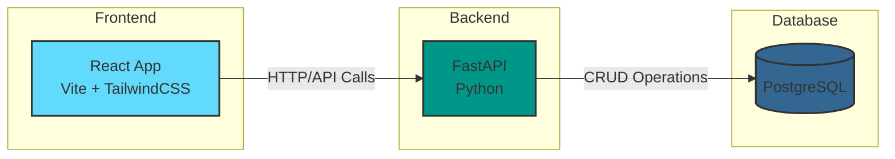

# Temator 🎤

**Temator** is a freestyle topic generator built for the WBW community and freestyle MCs. It serves randomized battle topics from a predefined database via a simple REST API and a modern React-based frontend.

---

## 🚀 Tech Stack

### Backend
- **Language**: Python 3.x
- **Framework**: FastAPI
- **Database**: PostgreSQL
- **Middleware**: CORS (Cross-Origin Resource Sharing)
- **Docs**: Swagger UI (auto-generated by FastAPI)

### Frontend
- **Framework**: React (with Vite)
- **Styling**: TailwindCSS
- **Icons**: Lucide React

### Tools
- **Testing**: Postman, curl
- **Build Tool**: Vite
- **Package Manager**: npm
- **Containerization**: Docker & Docker Compose

## 📊 System Architecture



---

## 🛠️ Getting Started

### Clone the Repository
```bash
git clone https://github.com/yourusername/temator.git
cd temator
```

### Option 1: Using Docker Compose (Recommended)
1. Make sure you have Docker and Docker Compose installed on your system
2. From the project root directory, run:
   ```bash
   docker compose up --build
   ```
3. Access the application:
   - Frontend: `http://localhost:3000`
   - Backend API: `http://localhost:8000`
   - API Documentation: `http://localhost:8000/docs`

To stop the services:
```bash
docker compose down
```

### Option 2: Manual Setup

#### Backend Setup
1. Navigate to the backend folder:
   ```bash
   cd backend
   ```
2. Create a virtual environment and activate it:
   ```bash
   python3 -m venv venv
   source venv/bin/activate  # On Windows use `venv\Scripts\activate`
   ```
3. Install dependencies:
   ```bash
   pip install -r requirements.txt
   ```
4. Run the FastAPI app:
   ```bash
   uvicorn main:app --reload
   ```
5. Access the API at:
   - `http://127.0.0.1:8000`
   - Interactive API docs:
     - Swagger UI: `http://127.0.0.1:8000/docs`
     - ReDoc: `http://127.0.0.1:8000/redoc`

#### Frontend Setup
1. Navigate to the frontend folder:
   ```bash
   cd ../frontend
   ```
2. Install dependencies:
   ```bash
   npm install
   ```
3. Start the development server:
   ```bash
   npm run dev
   ```
4. Open the app in your browser at:
   - `http://127.0.0.1:5173`

---

## 📚 API Documentation

FastAPI provides interactive documentation at:  
➡️ Swagger UI: `http://localhost:8000/docs`  
➡️ ReDoc: `http://localhost:8000/redoc`

### Available Endpoints

- `GET /health` - Health check endpoint
- `GET /topic` - Get a random topic

---

## 🧪 Example Usage

### Fetch a Random Topic
```bash
curl http://localhost:8000/topic
```

Response:
```json
{
  "topic": "Rap o złamanym mikrofonie"
}
```

---

## 🌱 Future Ideas

- Branding for WBW + hyperlinks
- Let users submit topics (pending admin approval)
- Email notifications on topic acceptance

---

## 🔗 Live Demo

(Coming soon...)  
🌍 https://temator.pl

---

## 📁 Project Structure

```
temator/
├── backend/          # Backend folder
│   ├── main.py       # FastAPI app entry point
│   └── requirements.txt  # Python dependencies
├── frontend/         # Frontend folder
│   ├── src/          # React source files
│   ├── index.css     # TailwindCSS styles
│   └── package.json  # Frontend dependencies
├── docker-compose.yml # Docker Compose configuration
└── README.md         # Project documentation
```

---

Made with ❤️ for the freestyle community.